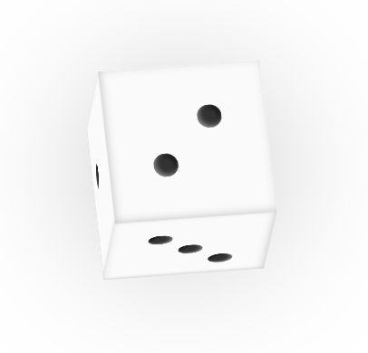
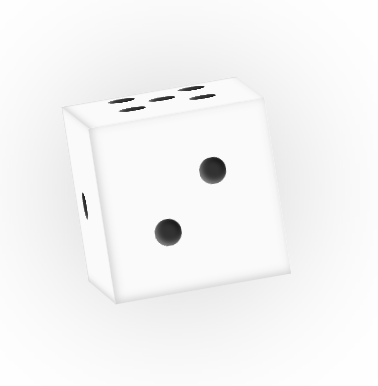

# react-cool-die

A cool die component for rendering a 3D die in React.

The die is built entirely using DOM elements with 3D CSS transformations

[npm](https://www.npmjs.com/package/react-cool-die)

## Requirements

-   React
-   Some kind of css loader

## Use

To add to your project

```
npm install --save react-cool-die
```

or if you use yarn

```
yarn add react-cool-die
```

CSS must then be imported into your project, either as a side effect in Javascript

```js
import 'react-cool-die/react-cool-die/output/theme.css';
```

or directly in CSS/SCSS

```css
@import '~react-cool-die/react-cool-die/output/theme';
```

To use:

```tsx
import * as React from 'react';
import { Die } from 'react-cool-die';

const MyCoolComponent = () => {
    const [value, setValue] = React.useState(5);
    const [rolling, setRolling] = React.useState(false);

    return <Die value={value} rolling={rolling} />;
};
```

`MyCoolComponent` takes three props

-   `value` (number) the current value to show on the die
-   `rolling` (boolean) whether to play the random rolling animation
-   `spin` (function) trigger a spin - this function is asyncronous

To use with a random roll:

```tsx
import * as React from 'react';
import { Die, useRandomDieRoll } from 'react-cool-die';

const MyCoolComponent = () => {
    const { rolling, value, spin } = useRandomDieRoll();

    return (
        <>
            <Die value={5} rolling={rolling} />
            <button onClick={spin}>spin</button>
        </>
    );
};
```

The only arg that `useRandomDieRoll` takes is `rollTime` which is the time for a roll to happen in milliseconds.

## Screenshots




LOOK AT IT GO
